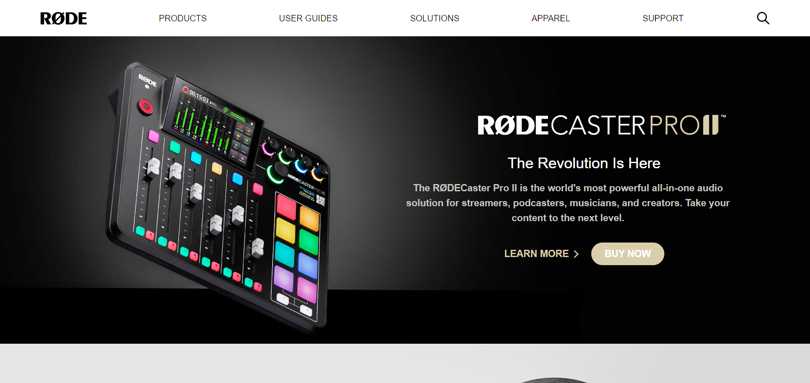
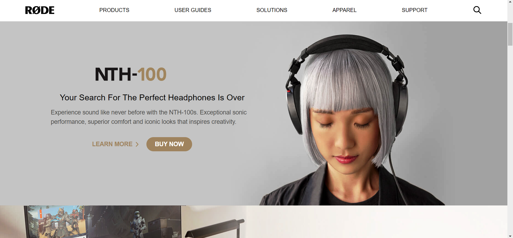
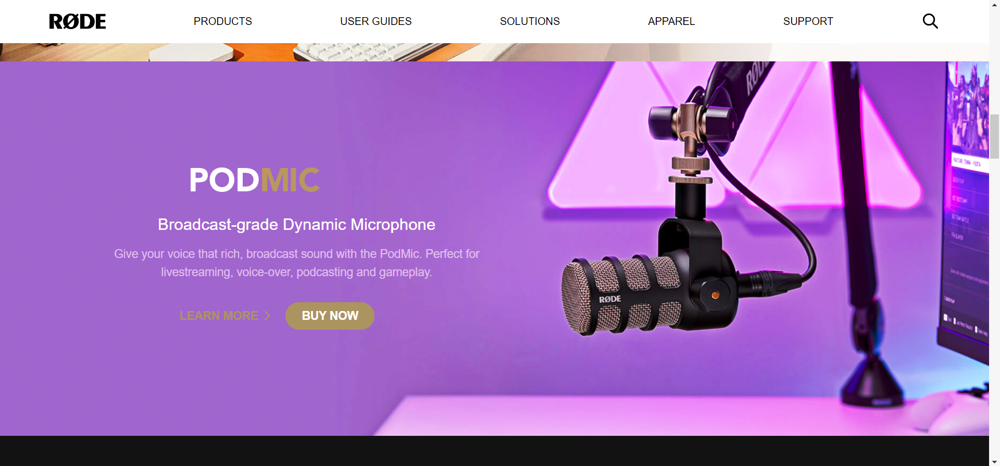
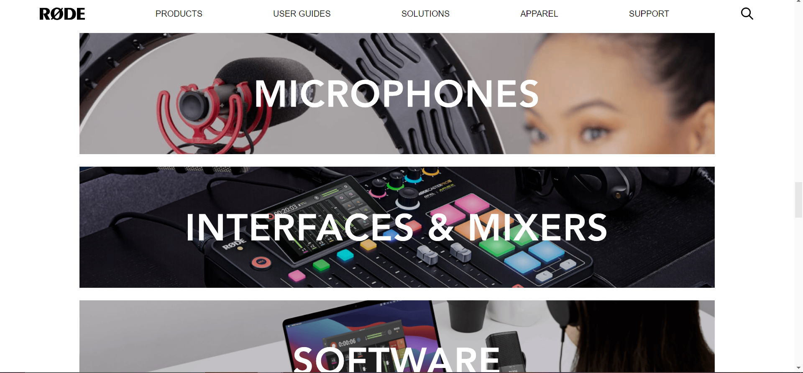
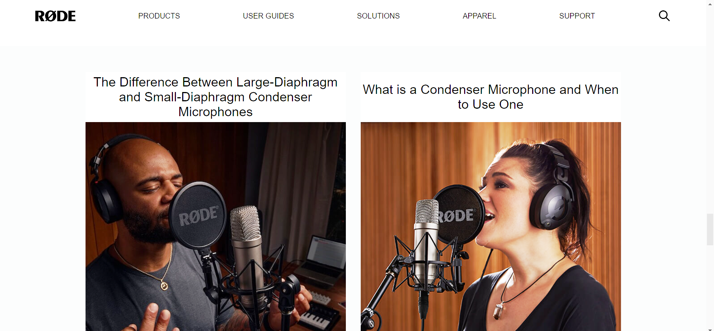
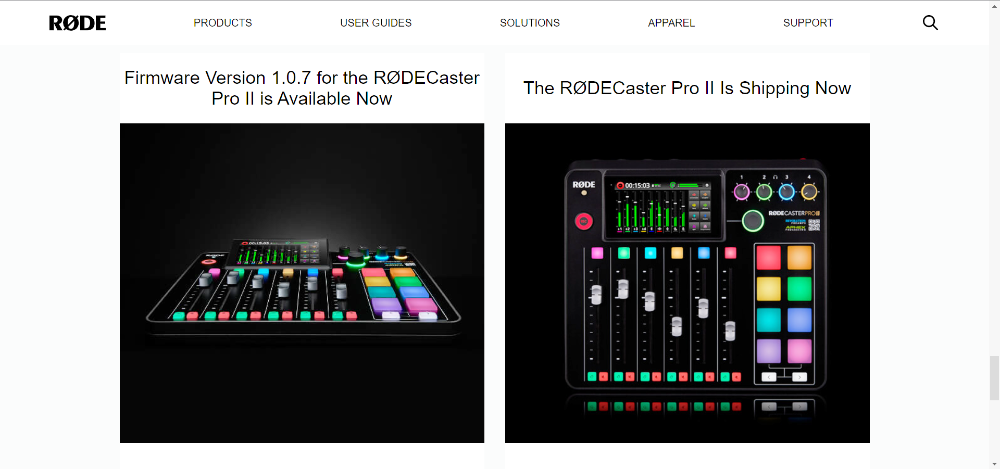
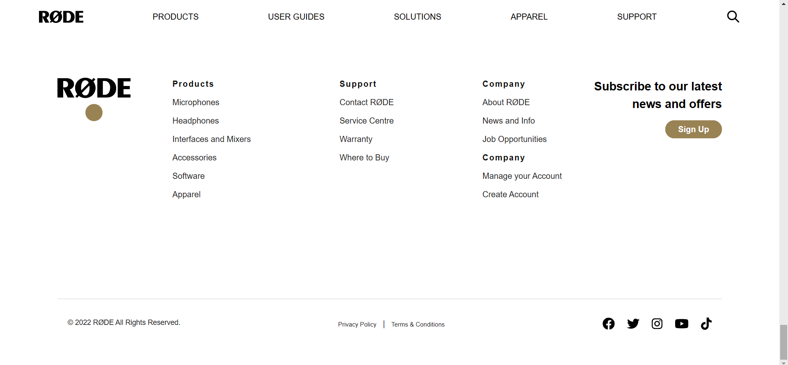

# RODE UI Fully Responsive project

 

## Project  [Live Link](https://vivek-rode.netlify.app/)

Completed this project only using Tailwind-CSS
  
  

## Time taken to finish this project

-   2 days to complete it.

 

## Screenshot 👇
 

